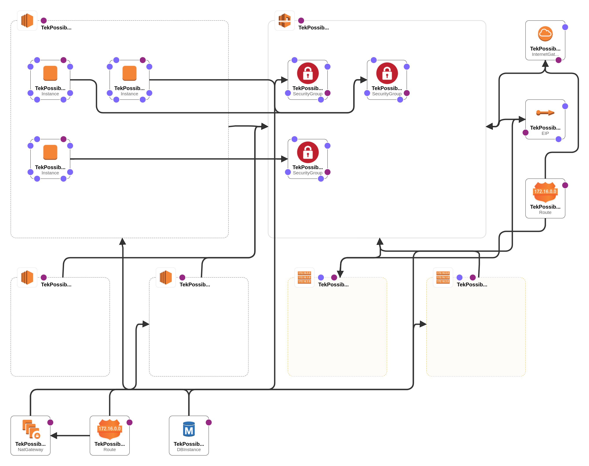

# TekPossible Networks (Example IaC Portfolio)
Fake Defense Contractor Cloud Deploy, Maintenance, Auditing, and Devops Scripts

**NOTE: This Project has no warranty, and is for educational/practice purposes only. It is definitely a work in progress. If something doesn't work, or you want to ask for a feature, feel free to open an issue.**

Will write more here once I am done with a plan/architecture diagram
## AWS CloudFormation Designer Generated Architecture Diagram (So Far)

## Planned Features and Resources
The point of the Ansible, Puppet, and CloudFormation scripts are to create and maintain a secure AWS cloud configuration that can be customized and automatically deployed.
At the moment, here are the planned or already implemented features of the TekPossible Portfolio
1. Deployment of a VPC with three subnets (Development, Test, Publc)
2. Deployment of a Mattermost Server in the Development Subnet
3. Deployment of a IaC Server in the Development Subnet (for enforcing compliance standards)
4. Deployment of a Nessus Server in the Development Subnet (for scanning for vulnerabilities)
5. Deployment of a Tailscale Server in the Development Subnet (for remote access to the development subnet with valid credentials to the tailnet)
6. Deployment of Development Server(s) (Remote Access for VSCode - not sure how I want to do this yet)
7. Deployment of Example Application(s) to Development Subnet
8. Deployment of CI/CD Pipelines to automatically build and deploy applications to test and production subnets (might do a blue/green deployment, but not sure)
9. Deployment of RDS servers to help with the custom apps as well as Mattermost servers
10. Automation for IAM Identity Center users, groups, permissionsets, and account bindings
11. Automation for Creating STIG compliant RHEL instances as AMIs for the base of all deployed EC2 instances
12. Automation for Routine Configuration enforcing via puppet, ansibble and cloudformation resources

## Prerequisites  (So Far)
User must have a valid AWS root account and be able to create the following prior to running automation
1. STS Static Credentials with AdministratorAccess IAM Role
2. Create an AWS Organization
3. Create an AWS IAM Identity Center and its associated Identity Store

